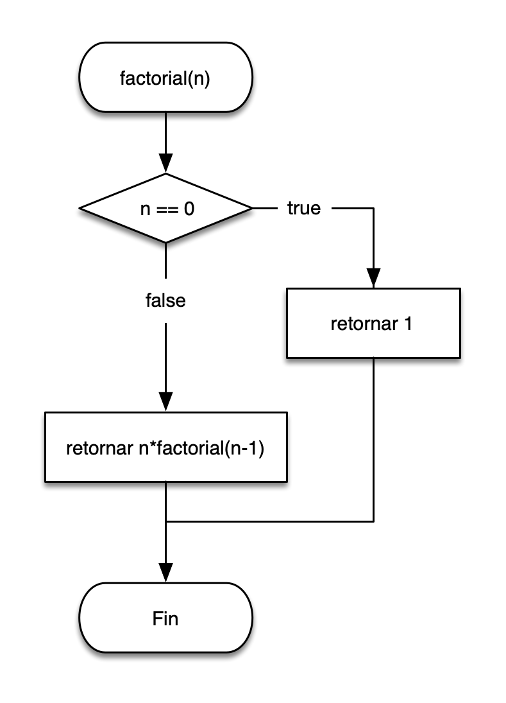

Escribe una función recursiva que calcule el [factorial](https://es.wikipedia.org/wiki/Factorial) de un número entero.

Llama a la función desde el programa principal y muestra los resultados hasta que el usuario escriba 0 como valor:

```
Número: 5
  Factorial: 120
Número: 18
  Factorial: 6402373705728000
Número: mm
  Error.
Número: 0
  Programa terminado.
```

## Restricciones

- Comprueba que los valores que escribe el usuario sean positivos y, si no, muestra un mensaje de error y vuelve a pedir
  el dato.
- Controla las posibles excepciones que se puedan producir.

## Sugerencias

En este diagrama puedes ver el algoritmo de la función:

